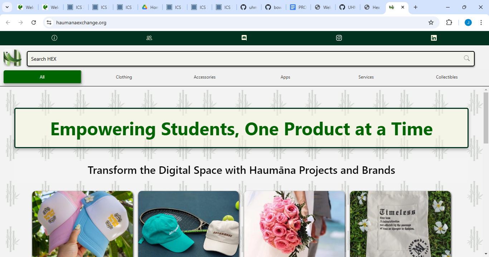
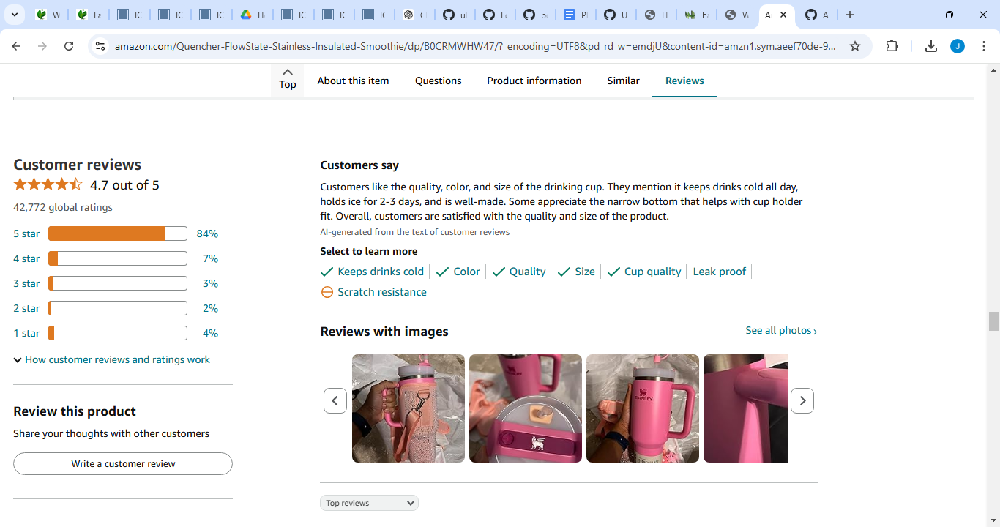

# Welcome to UHM Marketplace

## Table of contents
* [About UHM Marketplace](#about-uhm-marketplace)
* [Key Features](#key-features)
* [User Guide](#user-guide)
* [Getting Started](#get-started)
* [Support](#support)
* [Stay Connected](#stay-connected)

## About UHM Marketplace

datasource db {
  provider  = "postgresql"
  url       = env("POSTGRES_PRISMA_URL")
  directUrl = env("POSTGRES_URL_NON_POOLING")
}

UHM Marketplace is a comprehensive platform for University of Hawai‘i students and staff to buy, sell, and trade a wide variety of items, from electronics and textbooks to collectibles and accessories. Modeled after popular platforms like Amazon and eBay, UH Marketplace aims to provide users with a seamless and secure shopping experience tailored to the university community.

UHM Marketplace displays various different technologies useful for Software Engineering students such as:
* **Next.js** for server-side rendering and static site generation, enhancing load times and SEO.
* **React** for component-based UI development and efficient, interactive client-side rendering.
* **Bootstrap 5** for a clean, accessible, and responsive design, offering utility classes and pre-styled components that enhance user experience across all devices.

This platform also demonstrates useful design principles and functionalities:

* **Collections for Items, Users, and Transactions**, along with "join" collections to track interactions and ensure data consistency.
* **Filter and Sort Options** for users to navigate large inventories and find items efficiently.
* **Secure Data Management and Validation** on both client and server sides, ensuring a trusted environment.
* **Accessibility and Responsive Design** to provide a positive experience across different devices and user needs.

Through these features and technologies, UH Marketplace aims to become an essential platform for buying, selling, and trading within the UH community.

---

## Key Features

- **Product Listings**: Browse through a vast collection of items listed by sellers.

- **User Profiles**: Create a profile to manage your listings, purchases, and reviews.

  
- **Reviews and Ratings**: Leave feedback for sellers and buyers to build trust within the community.

---

## User Guide

1. **Sign Up**: Create an account to start buying or selling.
2. **Browse Items**: Use the search bar or categories to find items you want.
3. **Make Transactions**:
    - For Buyers: Add items to your cart and proceed to checkout.
    - For Sellers: List your items with detailed descriptions and pricing.
4. **Leave Feedback**: Rate your experience to help improve the marketplace.

---

## Get Started

Visit the [Marketplace](#) to explore items or [Sign Up](#) to create an account today.

---

## Support

Have questions or need assistance? Visit our [Help Center](#) or contact support at .

---

## Stay Connected

Follow us on:
- [Twitter](#)
- [Instagram](#)
- [Facebook](#)

---
